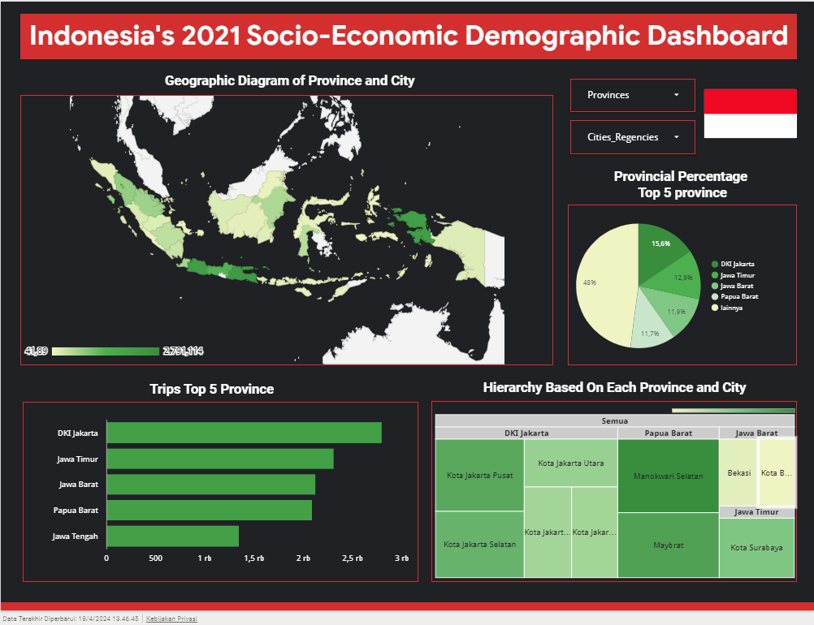

# Final_Project_Data_Engineering_Zoomcamp_2024

Welcome to my last project on the Zoomcamp platform organized by DataTalks.Club is The place to talk about data or Global online community of data enthusiasts.

# About_The_Project

This project about to Indonesia is an archipelago nation located in Southeast Asia. In this dataset there's several socio-economic measure of Indonesia in the year 2021. The data in this dataset was gathered from several reports from National Statistics Bureau (BPS). These variables are:

- Provinces
- Cities/Regencies
- Percentage of Poor People
- Regional GDP (in billion rupiah)
- Life Expectancy
- Average School Time
- Expenses per Capita

# A_Project_Includes_The_Following_Files:

- docker-compose.yaml: file used to configure the schedule project such as using airflow and Postgresql as database in locally
- Dockerfile for text containing the commands needed to create an image for executing ingestions
- Python scripts for executing ingestions, creating dags, ETL processes, and using Apache such as: Spark and Airflow
- Terraform for used provision and manage resources, such as virtual machines or cloud instances, networking, storage, and other components in your cloud environment
- Google Cloud Platform (GCP) is a cloud computing service product owned by Google. in the cloud it can minimize complexity and offer solutions for your storage, analytics, big data, machine learning and application development needs

# Technologies

- Cloud: Google Cloud Platform (GCP)
- Infrastructure as code (IaC): Terraform
- Workflow orchestration: Airflow
- RDBMS: PostgreSQL
- Data Lake: Google Cloud Storage
- Data Warehouse: BigQuery
- Batch processing: Spark
- Programming: Python and SQL
- Visualization: Looker Studio 

# Workflow

# Execution

1. Create docker compose in the docker-compose.yaml file and enter the applicable image procedure then run it with the docker compose build up -d command.
2. Extract the data in Kaggle with Python and open the data then clean the data with Spark. Example code is at Spark.ipynb
3. Create an access URL on Gihub after cleaning in Spark
4. Create python scripts for ingestions and dockerfiles to automate data transfer to RDBMS Postgresql in the Docker container. Example files are in Data_Ingestions.py and dockerfile along with requirements for the modules used. then executed or run in the terminal with the command:
docker run --network=final_project final_project_zoomcamp_2024 --user=ajied --password=admin --database=airflow --host=postgres --file=socio_economic_of_indonesia.parquet --table_name=socio_economic_of_indonesia --url=https://github. com/Ajied21/Final_Project_DE_Zoomcamp_2024/raw/304a573e40edf3bff6020a8797c3915363861637/data/socio_economic_of_indonesia.parquet
5. Check the data in pgadmin4 via the URL: http://localhost:8080. After successfully entering the PostgresQL RDBMS, then create a DAG for the batching process with Airflow and send it to Data Lake GCS or Google Cloud Storage. for the data file, it's in ./dags/DAG.py and run it at http://localhost:8085
6. Before sending it to GCP, first create a bucket and database, here I use Terraform to automate several services that are needed, such as: Google Cloud Storage and BigQuery. For example, the files are in the Terraform folder
6. Next, pull the data in Google Cloud Storage by taking the URI link in the bucket and entering the data warehouse or BigQuery then enter a SQL query to retrieve the data. for example sql queries in the Bigquery-sql folder.
7. Finally, after performing the SQL query then enter Looker Studio to carry out EDA or Exploratory Data Analysis.

# Data_Visualization

URL dashboard : https://lookerstudio.google.com/s/gD29cCWjO8w 

# Data Resources:

URL : https://www.kaggle.com/datasets/dannytheodore/socio-economic-of-indonesia-in-2021?select=2021socio_economic_indonesia.csv
