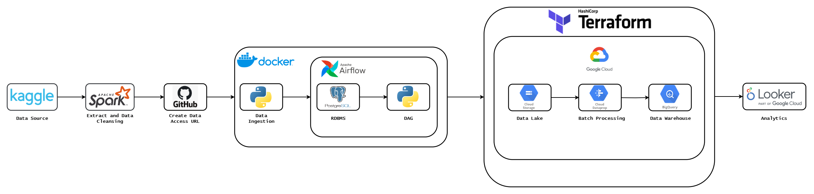

# Final_Project_Data_Engineering_Zoomcamp_2024

Welcome to my last project on the Zoomcamp platform organized by DataTalks.Club is The place to talk about data or Global online community of data enthusiasts.

# About_The_Project

This project about to Indonesia is an archipelago nation located in Southeast Asia. In this dataset there's several socio-economic measure of Indonesia in the year 2021. The data in this dataset was gathered from several reports from National Statistics Bureau (BPS). These variables are:

- Provinces
- Cities/Regencies
- Percentage of Poor People
- Regional GDP (in billion rupiah)
- Life Expectancy
- Average School Time
- Expenses per Capita

# A_Project_Includes_The_Following_Files:

- docker-compose.yaml: file used to configure the schedule project such as using airflow and Postgresql as database in locally
- Dockerfile for text containing the commands needed to create an image for executing ingestions
- Python scripts for executing ingestions, creating dags, ETL processes, and using Apache such as: Spark and Airflow
- Terraform for used provision and manage resources, such as virtual machines or cloud instances, networking, storage, and other components in your cloud environment
- Google Cloud Platform (GCP) is a cloud computing service product owned by Google. in the cloud it can minimize complexity and offer solutions for your storage, analytics, big data, machine learning and application development needs

# Workflow

